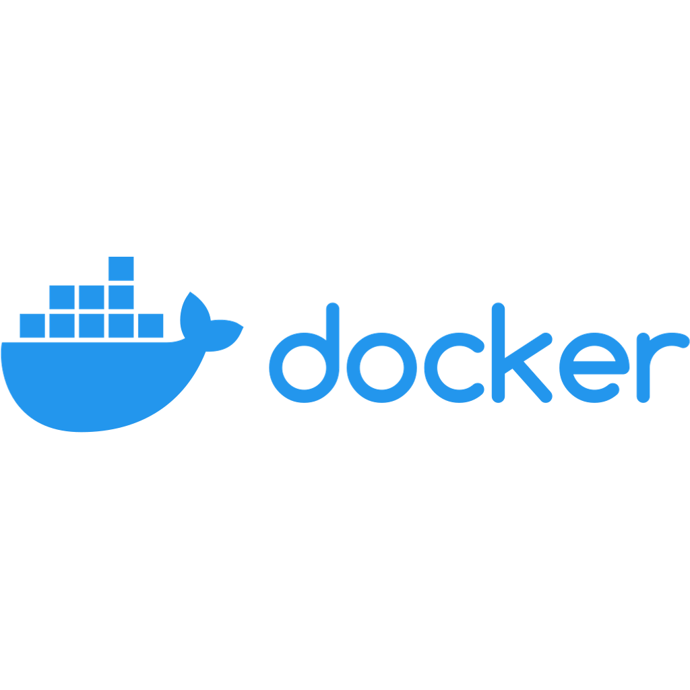

# 📚 Recursos de Aprendizaje y Referencia

<p align="center">
     
     
     
  
</p>

> **¡Amplía tu talento!** Esta guía te ayudará a reforzar y expandir habilidades necesarias para brillar en este Hackathon.

## ⚠️ Requisito Previo

Esta documentación es un **complemento para jóvenes que ya tienen bases en programación**. Si aún no sabes programar, te recomendamos primero aprender fundamentos en un lenguaje de programación antes de participar.

## 🎯 ¿Por dónde empezar?

Si ya tienes **experiencia básica en programación**, sigue este orden para expandir tus habilidades:

1. Profundiza en tu lenguaje principal (Python o JavaScript)
2. Aprende sobre IA, LLMs y APIs
3. Domina herramientas de automatización y despliegue
4. Git y GitHub para colaboración profesional
5. Docker para contenedores y despliegue en producción

---

## 🐍 Python - Tu primer lenguaje

### 📺 Cursos Completos en Español

- **[Python desde cero - Programador X](https://www.youtube.com/watch?v=Kp4Mvapo5kc)** ⭐ Recomendado
  - 8 horas, paso a paso, muy didáctico para principiantes absolutos
- **[Curso Python - Fazt](https://www.youtube.com/watch?v=6Fl8gV0g3j8)**
  - 4 horas, enfoque práctico con ejemplos reales
- **[Python para IA - freeCodeCamp](https://www.freecodecamp.org/espanol/news/aprende-python-gratis-con-este-curso-completo-de-14-horas/)**
  - 14 horas, enfocado en ciencia de datos e IA

### 🎮 Proyectos para practicar Python

- **Calculadora simple:** Variables, operaciones matemáticas
- **Juego de adivinar números:** Condicionales y loops
- **Lista de tareas (ToDo):** Archivos, funciones, listas
- **Analizador de texto:** Strings, diccionarios, conteo de palabras

### 🛠️ ¿Por qué Python?

- Sintaxis simple y legible (como escribir en inglés)
- Excelente para IA y automatización
- Gran comunidad y muchos recursos gratuitos
- Usado por Google, Netflix, Instagram

---

## 🌐 JavaScript - Para páginas web interactivas

### 📺 Cursos básicos

- **[JavaScript desde cero - Fazt](https://www.youtube.com/watch?v=RqQ1d1qEWlE)**
  - 3 horas, fundamentos esenciales
- **[JS moderno (ES6+) - Carlos Azaustre](https://www.youtube.com/watch?v=XI5OI3gK6bE)**
  - JavaScript actual con las últimas características

### 🎯 Por qué JavaScript?

- Lenguaje de la web (todas las páginas interactivas)
- Fácil de empezar combinándolo con HTML/CSS
- Una sola herramienta para frontend y backend (Node.js)
- Gran comunidad y frameworks modernos (React, Vue)

### 🎨 Tu primer proyecto web

1. Página personal con HTML/CSS
2. Calculadora interactiva
3. Lista de tareas con JavaScript
4. API simple con Node.js

---

## 🤖 Introducción a la Inteligencia Artificial

### 📺 ¿Qué es la IA y cómo funciona?

- **[¿Qué es la IA? Explicación simple](https://www.youtube.com/watch?v=5NgkMg-wJBw)**
- **[IA vs Machine Learning vs Deep Learning](https://www.youtube.com/watch?v=7W8A2x2iZvE)**

### 🛠️ Herramientas de IA que puedes usar (todas gratuitas)

- **ChatGPT/OpenAI:** Para generar texto, código, ideas y explicaciones
- **Ollama:** Ejecutar modelos de IA en tu propia computadora (no necesitas internet)
- **Hugging Face:** Biblioteca con miles de modelos pre-entrenados
- **LangChain:** Framework para conectar diferentes AIs y crear aplicaciones

### 🚀 Tu primer proyecto con IA

1. **Chatbot conversacional:** Pregunta-respuesta básica
2. **Generador de historias:** Crea cuentos personalizados con IA
3. **Analizador de sentimientos:** Detecta si un texto es positivo/negativo
4. **Clasificador de imágenes:** Identifica objetos en fotos
5. **Resumidor automático:** Resume textos largos

---

## ⚙️ Automatización - Haz que las máquinas trabajen por ti

### 📺 Introducción a la automatización

- **[¿Qué es RPA? Automatización de procesos](https://www.youtube.com/watch?v=example)**
- **[Automatización con Python - Básico](https://www.youtube.com/watch?v=example)**

### 🛠️ Herramientas para automatizar

- **Python + Selenium:** Automatizar navegadores web (scraping, testing)
- **n8n:** Interfaz visual drag-and-drop (muy fácil para principiantes)
- **Zapier/Make:** Conectar diferentes servicios sin programar
- **Scripts en Bash:** Automatizar tareas del sistema operativo

### 💡 Ideas de automatización para principiantes

- **Backup automático de archivos importantes**
- **Enviar correos automáticos de recordatorio**
- **Descargar y organizar archivos de internet**
- **Organizar fotos por fecha y ubicación**
- **Generar reportes automáticamente desde datos**

---

## 💻 Configura tu entorno de desarrollo

### 🛠️ Instalar VS Code (Editor de código recomendado)

1. **Descarga:** [code.visualstudio.com](https://code.visualstudio.com/)
2. **Instala:** Sigue los pasos del instalador (es muy simple)
3. **Configura:** Elige tu tema oscuro y tamaño de fuente cómodo

#### 📺 Videos de instalación y primeros pasos

- **[Instalar VS Code - Programador X](https://www.youtube.com/watch?v=example)**
- **[Primeros pasos en VS Code - Fazt](https://www.youtube.com/watch?v=example)**

### ⚡ Extensiones recomendadas para principiantes

**📦 Esenciales (instala estas primero):**

- **Python (Microsoft)** - Para programar en Python
- **JavaScript (ES6)** - Para JavaScript moderno
- **Prettier** - Formatear código automáticamente (importante!)
- **GitLens** - Mejor integración con Git
- **Live Server** - Ver páginas web en vivo mientras programas

**🎨 Para que sea más fácil de usar:**

- **Bracket Pair Colorizer** - Colores para paréntesis y corchetes
- **Indent Rainbow** - Colores para la indentación
- **Error Lens** - Muestra errores claramente en el código

### 🐧 Instalar Python (si elegiste Python)

1. **Descarga:** [python.org](https://python.org) - Elige la versión 3.11 o 3.12
2. **Instala:** Marca "Add Python to PATH" durante la instalación
3. **Verifica:** Abre terminal y escribe `python --version`

---

## 📦 GitHub - Comparte y colabora

### 🐙 ¿Qué es Git y GitHub?

- **Git:** Sistema para controlar versiones de tu código
- **GitHub:** Plataforma web donde guardas y compartes proyectos

### 📺 Tutoriales paso a paso

- **[Git y GitHub desde cero - Programador X](https://www.youtube.com/watch?v=example)**
- **[Crear cuenta y primer repo - Fazt](https://www.youtube.com/watch?v=example)**
- **[Flujo completo: código → GitHub](https://www.youtube.com/watch?v=example)**

### ⚡ Comandos Git más usados

```bash
# Configurar tu nombre y email (una sola vez)
git config --global user.name "Tu Nombre"
git config --global user.email "tu@email.com"

# Crear repositorio local
git init

# Agregar archivos
git add .

# Guardar cambios
git commit -m "Descripción de los cambios"

# Subir a GitHub
git push

# Ver estado
git status

# Descargar cambios
git pull
```

### 🚀 Proceso para subir tu proyecto al Hackatón

1. Crea cuenta gratuita en [github.com](https://github.com)
2. Haz clic en "New repository"
3. Dale un nombre descriptivo (ej: `mi-proyecto-hackaton`)
4. Marca "Public" (para que sea visible)
5. Sube tu código siguiendo los comandos de arriba

---

## 🐳 Docker - Ejecuta cualquier aplicación

### 📺 ¿Qué es Docker y por qué es útil?

- **[Docker explicado en 5 minutos](https://www.youtube.com/watch?v=example)**
- **[Instalar Docker - Guía completa](https://www.youtube.com/watch?v=example)**

### 🎯 Por qué Docker para el Hackatón?

- Tu proyecto funciona igual en cualquier computadora
- Fácil compartir con otros desarrolladores
- La Fundación puede probar tu proyecto fácilmente
- Profesional y moderno

### 🚀 Docker básico para principiantes

```dockerfile
# Dockerfile simple para aplicación Python
FROM python:3.11-slim

WORKDIR /app
COPY requirements.txt .
RUN pip install -r requirements.txt

COPY . .
CMD ["python", "app.py"]
```

---

## 📚 Más Recursos y Comunidad

### 🏆 Plataformas de aprendizaje gratuitas

- **[freeCodeCamp Español](https://www.freecodecamp.org/espanol/)** - Cursos completos con certificados
- **[Codecademy](https://www.codecademy.com/)** - Práctica interactiva
- **[Platzi](https://platzi.com/)** - Cursos en español (algunos gratuitos)

### 📺 Canales de YouTube recomendados

- **Fazt** - Tutoriales prácticos de programación
- **Píldoras Informáticas** - Cursos completos y detallados
- **Midudev** - Desarrollo web moderno con JavaScript
- **Soy Dalto** - Explicaciones claras y visuales
- **Programador X** - Git, GitHub y desarrollo desde cero

### 💬 Comunidades para preguntar

- **Discord de freeCodeCamp** - Pregunta en español
- **Reddit r/learnprogramming** - Comunidad internacional
- **Stack Overflow** - Para preguntas técnicas específicas
- **Issues de este repo** - Pregunta sobre el Hackatón

---

## 🎯 Checklist para principiantes

**Antes de empezar el Hackatón:**

- [ ] Instalar Python O JavaScript
- [ ] Instalar VS Code y extensiones básicas
- [ ] Crear cuenta en GitHub
- [ ] Hacer tu primer "Hola Mundo"
- [ ] Subir un proyecto simple a GitHub

**Durante el Hackatón:**

- [ ] Hacer commits frecuentes (cada cambio importante)
- [ ] Documentar tu código con comentarios
- [ ] Probar tu aplicación antes de entregar
- [ ] Pedir ayuda si algo no funciona

**Después del Hackatón:**

- [ ] Mejorar tu proyecto basado en feedback
- [ ] Agregarlo a tu portafolio personal
- [ ] Compartirlo en redes sociales
- [ ] Seguir aprendiendo nuevas tecnologías

---

¡Ánimo! Todos empezamos desde cero. Lo importante es la **constancia y la curiosidad**. Si dedicas tiempo diario, en unas semanas podrás crear proyectos increíbles. 🚀

¿Dudas? Crea un Issue usando la plantilla "Pregunta / Duda" en este repositorio.
