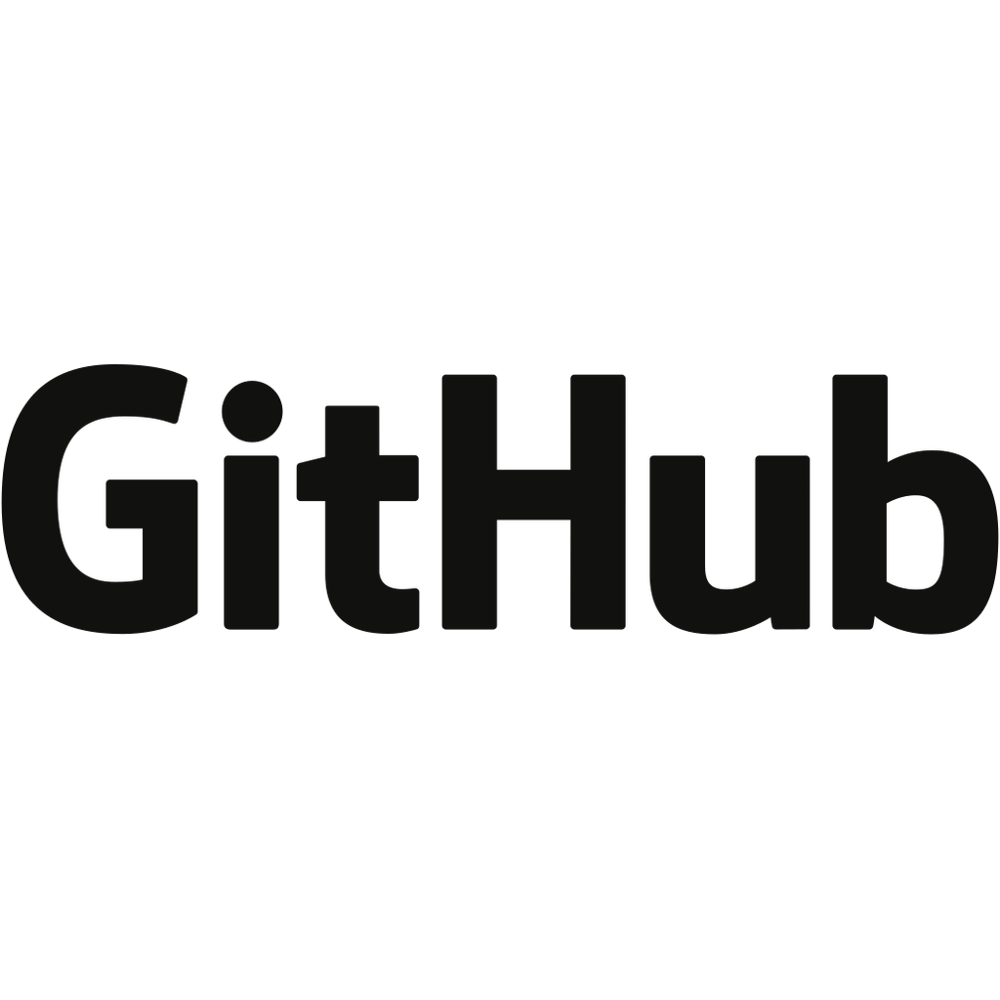
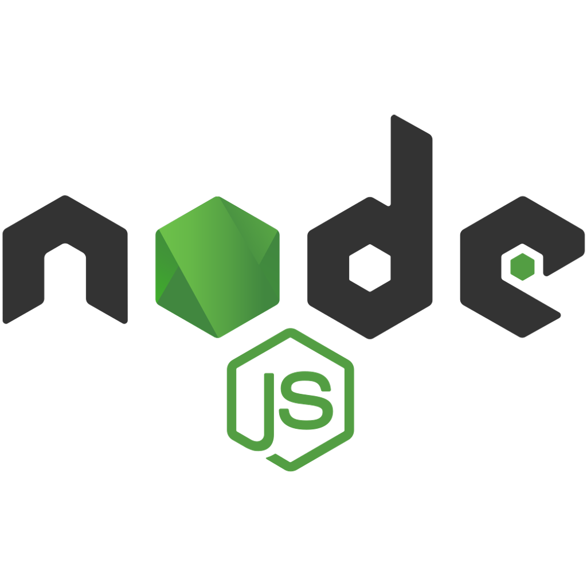
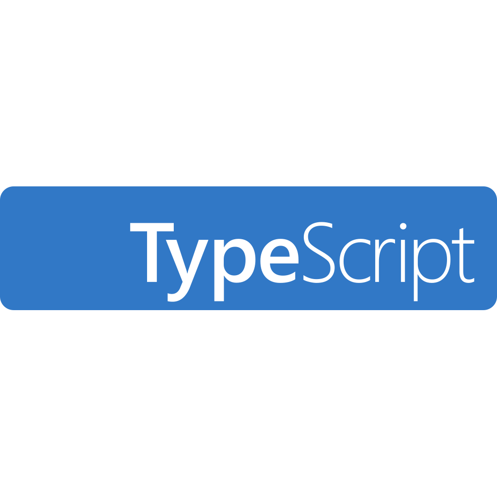
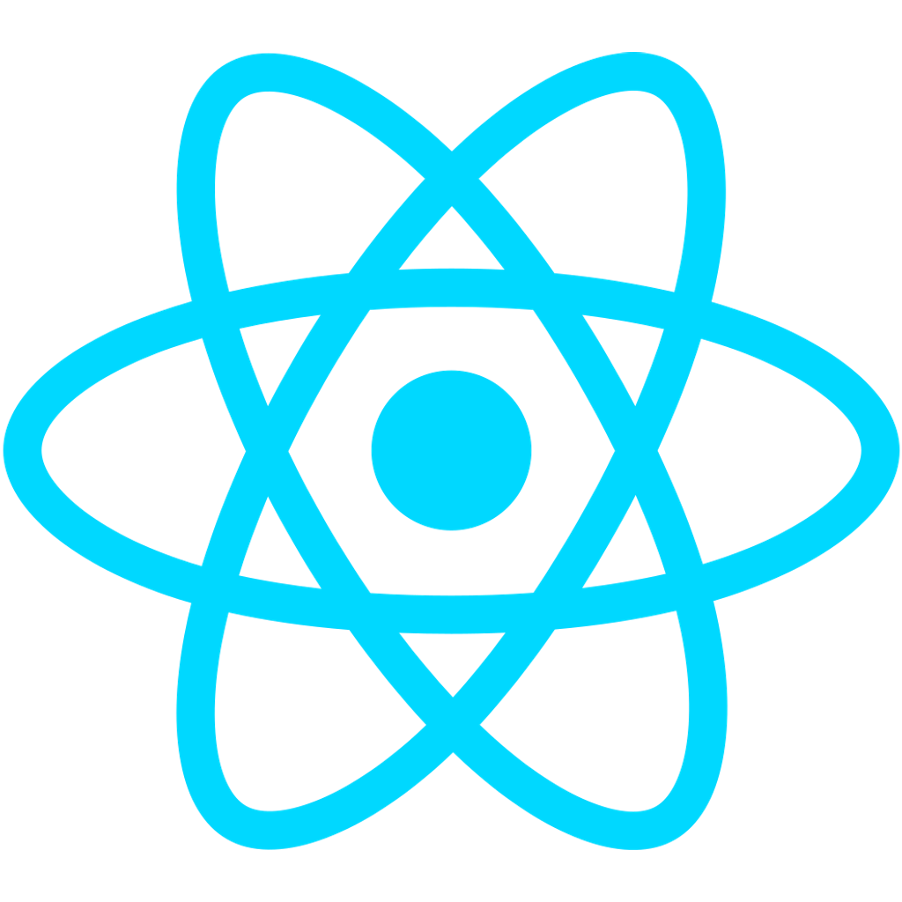
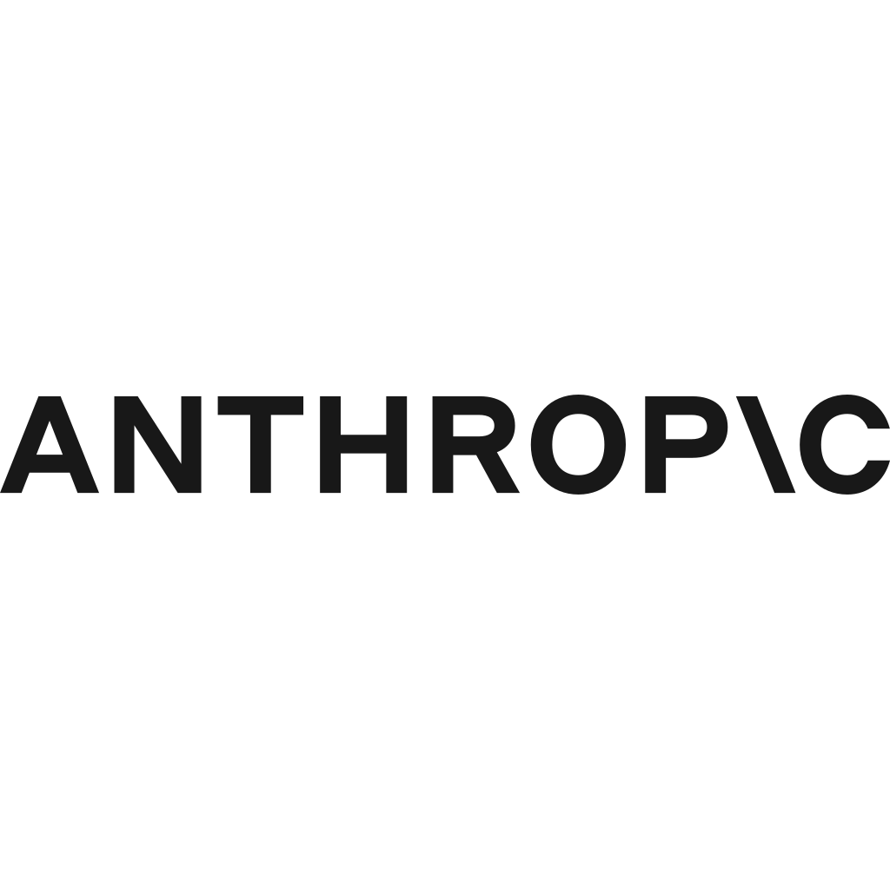
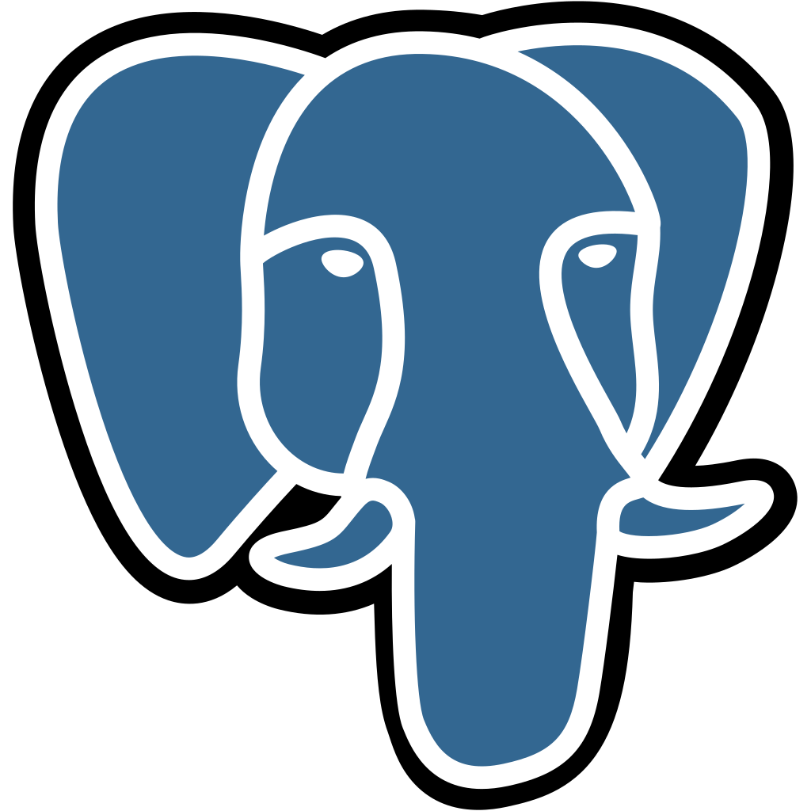
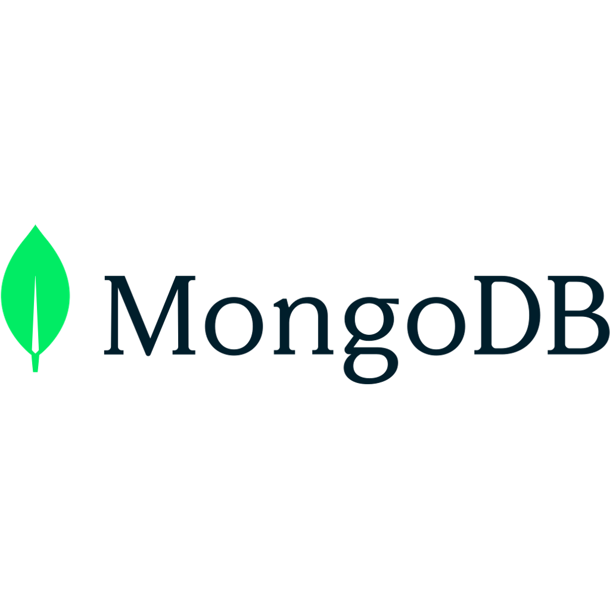

# 🤖 Hackathon de Innovación: IA & Automatización 2026

  

---

## 🏛️ Fundación ProMiTierra | Caquetá, Colombia

> *"No es solo una competencia, es un taller para aprender, crear y transformar tu futuro con tecnología."*

### ¿Quién es Fundación ProMiTierra?

Somos una organización sin ánimo de lucro dedicada a promover el desarrollo tecnológico y ambiental en el departamento del Caquetá. Nuestra misión es ayudar a las personas a reducir su pobreza mediante la generación de iniciativas, campañas y proyectos de innovación social útiles para la sociedad.

---

## 🌿 Nuestra Misión

> *"Juntos Sí, Solos No. La Voluntad es Fuerza!"*

Construimos un mundo mejor, fortalecemos el tejido social en comunidades donde todos tienen la oportunidad de contribuir y recibir.

---

## 🎯 Nuestro Objetivo

Este Hackathon va más allá de ganar un premio. Es una oportunidad para:

- **Aprender** habilidades prácticas en Inteligencia Artificial y Automatización
- **Crear** soluciones reales a problemas de tu comunidad
- **Conectar** con otros jóvenes innovadores del Caquetá
- **Desarrollar** un proyecto para tu portafolio profesional
- **Ganar** experiencia laboral real para tu futuro

---

## 📅 Fechas (Por Definir)

| Etapa | Fecha |
|------|-------|
| 📝 Inscripción | Por definir |
| 🚀 Inicio del Hackathon | Por definir |
| ⏰ Entrega de Proyectos | Por definir |
| 🏆 Anuncio de Ganadores | Por definir |

---

## 📍 Modalidad: Presencial

El Hackathon se realizará de manera **presencial** en las instalaciones de la Fundación ProMiTierra.

Los equipos irán acompañados por:
- 👨‍🏫 **Tutores técnicos** que guiarán tu desarrollo
- 👩‍💼 **Mentores** de proyectos para Ideas y negocios
- 🔧 **Soporte técnico** disponible durante todo el evento

---

## 🎯 Temas Centrales

### 1. Automatización de Procesos
Reduce tareas operativas mediante software. Optimiza flujos de trabajo, elimina manualidades y aumenta eficiencia en empresas u organizaciones.

### 2. Implementación de IA
Integra modelos de lenguaje (LLMs), visión artificial o análisis predictivo para resolver problemas específicos del Caquetá.

### 3. Despliegue Profesional
Aprende a poner tus soluciones en producción usando infraestructuras modernas como Docker y DockPloy.

---

## 💰 Premios e Incentivos (Por Definir)

| Lugar | Premio |
|-------|--------|
| 🥇 1er Lugar | Por definir |
| 🥈 2do Lugar | Por definir |
| 🥉 3er Lugar | Por definir |

**Todos los participantes recibirán:**
- ✅ Certificado de participación
- ✅ Acceso a recursos de aprendizaje exclusivos
- ✅ Red de contactos con profesionales del sector

---

## 🚀 Infraestructura: DockPloy

  

Para esta edición, contamos con el respaldo del servidor empresarial de la Fundación y aliados, utilizando **DockPloy**.

DockPloy es nuestra plataforma de orquestación. Los proyectos destacados podrás ser desplegados en vivo para pruebas de concepto (PoC) en nuestro entorno seguro.

> 📖 Consulta [DOCUMENTACION_TECNICA.md](./Documentacion/DOCUMENTACION_TECNICA.md) para las instrucciones de configuración.

---

## 💻 Tech Stack / Tecnologías

   &nbsp;&nbsp;
   &nbsp;&nbsp;
  

   &nbsp;&nbsp;
   &nbsp;&nbsp;
   &nbsp;&nbsp;
  

   &nbsp;&nbsp;
   &nbsp;&nbsp;
  

   &nbsp;&nbsp;
  

---

## 📂 Estructura del Repositorio

| Carpeta | Descripción |
|--------|-------------|
| 📄 [README.md](./README.md) | Este archivo - Información general |
| 📚 [Documentacion](./Documentacion/) | Guías técnicas, reglas, evaluación |
| 📝 [Inscripcion - Entrega](./Inscripcion%20-%20Entrega/) | Plantillas para inscribirse y entregar |
| 👥 [Participantes](./Participantes/) | Lista de equipos inscritos |
| 📦 [Plantillas](./Plantillas/) | Plantilla opcional para tu proyecto |

---

## 🏃 ¿Cómo Participar?

### Opción 1: Desde GitHub (Recomendado)
1. **Inscribete:** Ve a [Issues](./Inscripcion%20-%20Entrega/) y usa la plantilla "Inscripción Participante"
2. **Desarrolla:** Crea tu proyecto usando las tecnologías que prefieras
3. **Entrega:** Usa la plantilla "Entrega de Solución" cuando termines

### Opción 2: Página Web
También puedes inscribirte directamente:

**[📝 Inscribirte aquí](https://juan-guillermo-ferrer1.github.io/HACKATON-FUNDACION-PROMITIERRA/)**

---

## 🛠️ ¿Quién Puede Participar?

**¡Este Hackathon es para TODO el público!**

No necesitas ser un experto. Lo importante es:
- ✅ Tener ganas de aprender
- ✅ Tener conocimientos básicos en cualquier área tecnológica (programación, diseño, datos, etc.)
- ✅ Puedes ser principiante, intermedio o avanzado
- ✅ Tener una idea que quieras desarrollar

**Equipos de 2 a 4 personas**

---

## 🛠️ Herramientas Sugeridas

Estas son algunas tecnologías que puedes usar, pero **puedes usar cualquiera con la que te sientas cómodo**:

- **Lenguajes:** Python, JavaScript, TypeScript, y más
- **IA:** OpenAI, Anthropic, Ollama, Hugging Face, LangChain
- **Automatización:** n8n, Zapier, Make
- **Bases de datos:** PostgreSQL, MongoDB, Firebase
- **Frontend:** React, Vue, HTML/CSS
- **Backend:** Node.js, FastAPI, Flask
- **Contenedores:** Docker (opcional)

---

## 💡 ¿Por Qué Participar?

> "La tecnología no es solo una herramienta, es el motor que transformará nuestra Amazonía. En la Fundación ProMiTierra, creemos que el próximo gran algoritmo de IA se escribirá aquí, en el Caquetá."

### Beneficios reales:
-🎓 Aprende habilidades que el mercado laboral necesita
-🌱 Contribuye al desarrollo de tu región
-🤝 Conecta con profesionales y aliados
-💼 Construye tu portafolio técnico
-🏆 Gana experiencia en competitions

---

## 📍 Sede Principal

- **Ciudad:** Medellín, Colombia
- **Presencia en:** Caquetá, Bogotá

---

## 📧 Contacto

- **📱 Teléfono:** +57 311 612 4993
- **📧 Email:** [Por definir - revisar sitio oficial]
- **🌐 Web:** www.promitierra.org

### Redes Sociales

- **Facebook:** @promitierra
- **Twitter:** @promitierra_fun
- **Instagram:** @promitierra
- **WhatsApp:** [Envíanos un mensaje](https://wa.me/message/SBDTEPUTLDLNP1)
- **Linktree:** [linktr.ee/promitierra](https://linktr.ee/promitierra)

---

*🎯 ¡Más que una competencia, es un taller para aprender!*

---

© 2026 Fundación ProMiTierra - Innovación con Sentido Humano.